<br>
# Follower <br>
Follows a target object or a path of waypoints <br>
<br>
Author: skymen <br>
<sub>Made using [c3ide2-framework](https://github.com/ConstructFund/c3ide2-framework) </sub><br>

## Table of Contents
- [Usage](#usage)
- [Examples Files](#examples-files)
- [Properties](#properties)
- [Actions](#actions)
- [Conditions](#conditions)
- [Expressions](#expressions)
---
## Usage
To build the addon, run the following commands:

```
npm i
node ./build.js
```

To run the dev server, run

```
npm i
node ./dev.js
```

The build uses the pluginConfig file to generate everything else.
The main files you may want to look at would be instance.js and scriptInterface.js

## Examples Files

---
## Properties
| Property Name | Description
| --- | --- |
| [Follow Mode](#follow-mode) | Direct = follow the target directly, Waypoint = follow a path of waypoints |
| [Follow Speed](#follow-speed) | Speed to follow the target at. In Waypoints mode, negative speed will do one waypoint at a time. In lerp mode, this is the lerp speed. |
| [Follow Distance](#follow-distance) | Distance to keep from the target |
| [Set Angle](#set-angle) | Set the angle of the follower |
| [Follow X](#follow-x) | Follow the target on the X axis |
| [Follow Y](#follow-y) | Follow the target on the Y axis |
| [Follow Z](#follow-z) | Follow the target on the Z axis |
| [Follow Angle](#follow-angle) | Follow the target's angle |
| [Auto Target Parent](#auto-target-parent) | Automatically target the parent of the follower |
---
### Follow Mode
**Description:** <br> Direct = follow the target directly, Waypoint = follow a path of waypoints </br>
**Type:** <br> combo
**Options:**
- direct: Direct
- waypoint: Waypoint
- lerp: Lerp
### Follow Speed
**Description:** <br> Speed to follow the target at. In Waypoints mode, negative speed will do one waypoint at a time. In lerp mode, this is the lerp speed. </br>
**Type:** <br> float
### Follow Distance
**Description:** <br> Distance to keep from the target </br>
**Type:** <br> float
### Set Angle
**Description:** <br> Set the angle of the follower </br>
**Type:** <br> check
### Follow X
**Description:** <br> Follow the target on the X axis </br>
**Type:** <br> check
### Follow Y
**Description:** <br> Follow the target on the Y axis </br>
**Type:** <br> check
### Follow Z
**Description:** <br> Follow the target on the Z axis </br>
**Type:** <br> check
### Follow Angle
**Description:** <br> Follow the target's angle </br>
**Type:** <br> check
### Auto Target Parent
**Description:** <br> Automatically target the parent of the follower </br>
**Type:** <br> check

---
## Actions
| Action | Description |
| --- | --- |
| [Set follow mode](#set-follow-mode) | Set the follow mode |
| [Set follow speed](#set-follow-speed) | Set the follow speed |
| [Set follow distance](#set-follow-distance) | Set the follow distance |
| [Follow](#follow) | Follow |
| [Unfollow](#unfollow) | Unfollow |
| [Set angle to angle of motion](#set-angle-to-angle-of-motion) | Wether to set the angle to the angle of motion |
| [Set axes](#set-axes) | Wether to follow on the X, Y and Z axis |
| [Add waypoint](#add-waypoint) | Add a waypoint |
| [Set waypoint](#set-waypoint) | Set a waypoint |
| [Remove waypoint](#remove-waypoint) | Remove a waypoint |
| [Clear waypoints](#clear-waypoints) | Clear all waypoints |
---
### Set follow mode
**Description:** <br> Set the follow mode </br>
#### Parameters:
| Name | Type | Description |
| --- | --- | --- |
| Mode | combo | The follow mode |
### Set follow speed
**Description:** <br> Set the follow speed </br>
#### Parameters:
| Name | Type | Description |
| --- | --- | --- |
| Speed | number | The follow speed |
### Set follow distance
**Description:** <br> Set the follow distance </br>
#### Parameters:
| Name | Type | Description |
| --- | --- | --- |
| Distance | number | The follow distance |
### Follow
**Description:** <br> Follow </br>
#### Parameters:
| Name | Type | Description |
| --- | --- | --- |
| Target | object | The target to follow |
### Unfollow
**Description:** <br> Unfollow </br>
### Set angle to angle of motion
**Description:** <br> Wether to set the angle to the angle of motion </br>
#### Parameters:
| Name | Type | Description |
| --- | --- | --- |
| Set Angle | boolean | Wether to set the angle to the angle of motion |
### Set axes
**Description:** <br> Wether to follow on the X, Y and Z axis </br>
#### Parameters:
| Name | Type | Description |
| --- | --- | --- |
| X | boolean | Wether to follow on the X axis |
| Y | boolean | Wether to follow on the Y axis |
| Z | boolean | Wether to follow on the Z axis |
### Add waypoint
**Description:** <br> Add a waypoint </br>
#### Parameters:
| Name | Type | Description |
| --- | --- | --- |
| X | number | The X position of the waypoint |
| Y | number | The Y position of the waypoint |
| Z | number | The Z position of the waypoint |
| Angle | number | The angle of the waypoint |
### Set waypoint
**Description:** <br> Set a waypoint </br>
#### Parameters:
| Name | Type | Description |
| --- | --- | --- |
| Index | number | The index of the waypoint to set |
| X | number | The X position of the waypoint |
| Y | number | The Y position of the waypoint |
| Z | number | The Z position of the waypoint |
| Angle | number | The angle of the waypoint |
### Remove waypoint
**Description:** <br> Remove a waypoint </br>
#### Parameters:
| Name | Type | Description |
| --- | --- | --- |
| Index | number | The index of the waypoint to remove |
### Clear waypoints
**Description:** <br> Clear all waypoints </br>

---
## Conditions
| Condition | Description |
| --- | --- |
| [Is following](#is-following) | Is following |
| [Is angle set to angle of motion](#is-angle-set-to-angle-of-motion) | Is angle set to angle of motion |
---
### Is following
**Description:** <br> Is following </br>
### Is angle set to angle of motion
**Description:** <br> Is angle set to angle of motion </br>

---
## Expressions
| Expression | Description |
| --- | --- |
| [FollowDistance](#followdistance) | Follow distance |
| [FollowTargetUID](#followtargetuid) | Follow target UID |
| [Speed](#speed) | Speed |
| [AngleOfMotion](#angleofmotion) | Angle of motion |
| [WayPointX](#waypointx) | Waypoint X |
| [WayPointY](#waypointy) | Waypoint Y |
| [WayPointZ](#waypointz) | Waypoint Z |
| [WayPointAngle](#waypointangle) | Waypoint angle |
| [WayPointCount](#waypointcount) | Waypoint count |
---
### FollowDistance
**Description:** <br> Follow distance </br>
**Return Type:** <br> number </br>
### FollowTargetUID
**Description:** <br> Follow target UID </br>
**Return Type:** <br> number </br>
### Speed
**Description:** <br> Speed </br>
**Return Type:** <br> number </br>
### AngleOfMotion
**Description:** <br> Angle of motion </br>
**Return Type:** <br> number </br>
### WayPointX
**Description:** <br> Waypoint X </br>
**Return Type:** <br> number </br>
#### Parameters:
| Name | Type | Description |
| --- | --- | --- |
| Index | number | The index of the waypoint |
### WayPointY
**Description:** <br> Waypoint Y </br>
**Return Type:** <br> number </br>
#### Parameters:
| Name | Type | Description |
| --- | --- | --- |
| Index | number | The index of the waypoint |
### WayPointZ
**Description:** <br> Waypoint Z </br>
**Return Type:** <br> number </br>
#### Parameters:
| Name | Type | Description |
| --- | --- | --- |
| Index | number | The index of the waypoint |
### WayPointAngle
**Description:** <br> Waypoint angle </br>
**Return Type:** <br> number </br>
#### Parameters:
| Name | Type | Description |
| --- | --- | --- |
| Index | number | The index of the waypoint |
### WayPointCount
**Description:** <br> Waypoint count </br>
**Return Type:** <br> number </br>